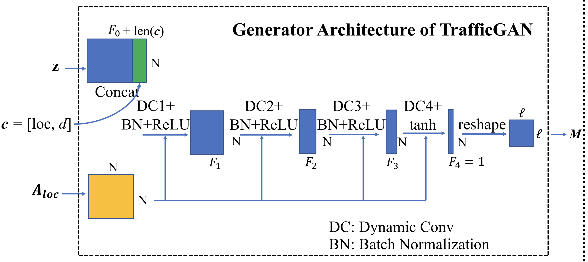
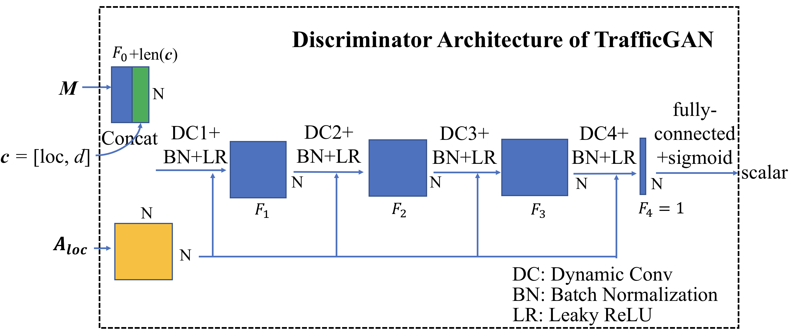

# TrafficGAN
The codes and data of paper "TrafficGAN: Off-Deployment Traffic Estimation with Traffic Generative Adversarial Networks". 

This is the overview of TrafficGAN. The implementation is realized using Pytorch.

# Requirements for Reproducibility
- Cuda 9.2
- pytorch 0.4.1
- Python 3.6.7
- Devices: NVIDIA GTX 1080 GPUs
- System: Ubuntu 16.04
